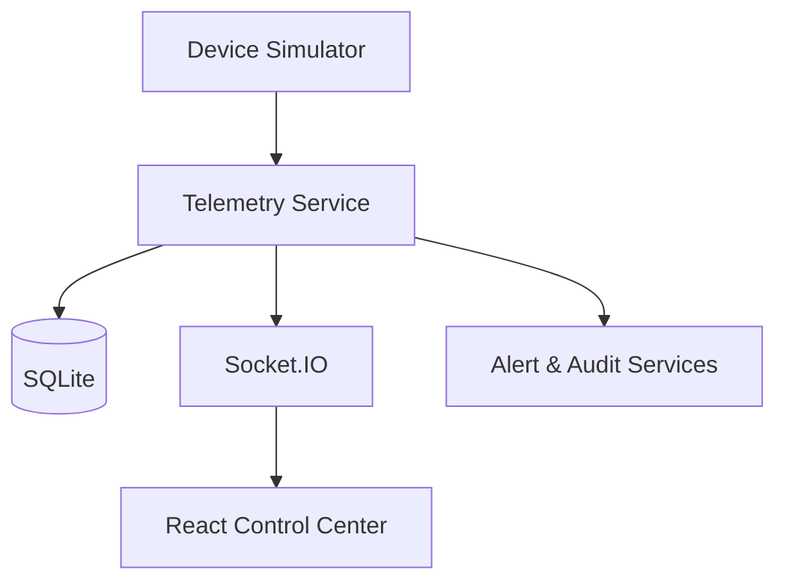
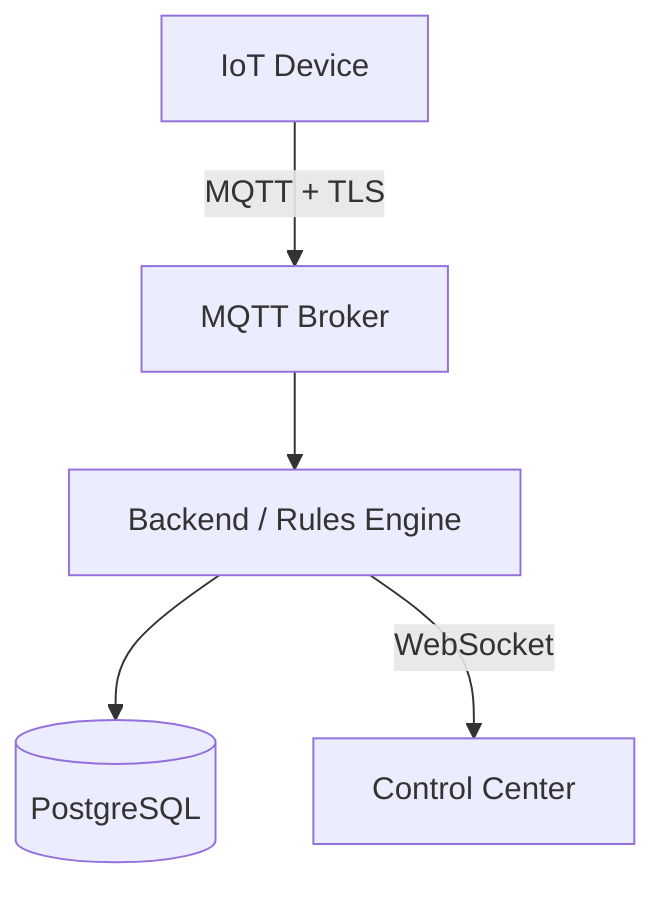

# RailGuard

Demo full-stack para supervisar telemetría, seguridad y descarga de vagones ferroviarios que transportan pellet a granel. Los dispositivos son simulados; no controla hardware real.

## Inicio rápido

Requisitos: Node.js 20+ y npm.

```bash
npm install
npm run dev
```

Abre `http://localhost:5173`. El comando inicia el frontend Vite y la API Socket.IO/Express en `http://localhost:3001`. Al primer arranque se crea `railguard.db` con el seed automático.

Para verificar el proyecto:

```bash
npm run lint
npm run typecheck
npm run build
```

## Despliegue: Vercel + Railway

RailGuard se divide en dos servicios para preservar Socket.IO y la base de datos: **Vercel aloja el dashboard React** y **Railway ejecuta la API persistente**. No despliegues el backend en Vercel: las funciones serverless no mantienen conexiones Socket.IO ni un disco SQLite persistente.

### 1. Subir a GitHub

```bash
git init
git add .
git commit -m "feat: RailGuard control center"
git branch -M main
git remote add origin https://github.com/TU_USUARIO/railguard.git
git push -u origin main
```

La acción de GitHub incluida en `.github/workflows/ci.yml` ejecuta lint, typecheck y build en cada push/PR. El archivo `.gitignore` evita subir la base local, compilados o dependencias.

### 2. Backend en Railway

1. Crea un proyecto Railway desde el repositorio y selecciona el `Dockerfile` incluido.
2. Agrega un **Volume** montado exactamente en `/data`.
3. Configura las variables: `DATABASE_PATH=/data/railguard.db`, un `JWT_SECRET` largo y aleatorio, y después `CLIENT_ORIGIN=https://TU_APP.vercel.app`.
4. Railway ejecuta el health check en `/api/health`. Conserva el volumen al redeplegar: allí vive SQLite y el seed se aplica solo la primera vez.
5. Copia la URL pública del backend, por ejemplo `https://railguard-api.up.railway.app`.

### 3. Frontend en Vercel

1. Importa el mismo repositorio en Vercel. Detectará Vite y utilizará `vercel.json`.
2. Antes de desplegar, en **Settings → Environment Variables**, crea:
   - `VITE_API_URL=https://TU_BACKEND.up.railway.app/api`
   - `VITE_SOCKET_URL=https://TU_BACKEND.up.railway.app`
3. Despliega. Copia la URL de Vercel en `CLIENT_ORIGIN` del backend Railway y redepliega Railway.
4. Si cambias una variable `VITE_*`, vuelve a desplegar Vercel: Vite las incorpora durante el build.

`JWT_SECRET` no debe subirse nunca a GitHub ni definirse como variable `VITE_*`.

## Cuentas demo

| Rol | Correo | Contraseña |
| --- | --- | --- |
| ADMIN | admin@railguard.demo | Admin123! |
| OPERATOR | operator@railguard.demo | Operator123! |
| VIEWER | viewer@railguard.demo | Viewer123! |

El código de segundo factor para la demostración es `123456`.

## Flujo de demostración

1. Inicia como `operator@railguard.demo`.
2. Abre `TRIP-2026-001` (Tampico → Monterrey) en **Viajes**.
3. Selecciona `WGN-008` e intenta desbloquearlo: se rechaza mientras esté fuera de la geocerca y se audita la decisión.
4. En **Simulador**, provoca batería baja (`WGN-004`), manipulación (`WGN-007`) o pérdida de conexión (`WGN-010`). Las alertas aparecen al instante.
5. Pulsa **Mover tren al destino**, abre de nuevo `WGN-008`, solicita el desbloqueo e introduce `123456`.
6. El candado pasa a `UNLOCKED` y se registra `UNLOCK_AUTHORIZED` en la bitácora.

## Arquitectura



El servidor separa las áreas de autenticación/autorización, telemetría y simulación, geocerca Haversine, alertas y auditoría. El desbloqueo se autoriza únicamente en el backend: estado del viaje, asignación, conexión, geocerca, rol, candado, compuerta y alerta de tamper se comprueban antes de solicitar el MFA demo.

## Endpoints principales

- `POST /api/auth/login`
- `GET|POST /api/trips`, `GET /api/trips/:id`, `POST /api/trips/:id/start`
- `GET /api/wagons/:id`, `POST /api/wagons/:id/request-unlock`, `POST /api/wagons/:id/confirm-unlock`
- `GET /api/dashboard`, `GET /api/alerts`, `POST /api/alerts/:id/acknowledge`, `GET /api/audit`
- `POST /api/simulator/event`

Eventos Socket.IO: `telemetry:update`, `wagon:status`, `trip:position`, `alert:new`, `alert:update`, `audit:new` y `unlock:status`.

## PRODUCTION ARCHITECTURE

Una plataforma real debería usar MQTT sobre TLS, certificados por dispositivo y mTLS cuando aplique; Secure Element para identidad, comandos firmados con nonce, timestamp, vencimiento y protección contra replay. También MFA/TOTP real, RBAC centralizado, cifrado de datos sensibles, firmware firmado, OTA seguro y un registro de auditoría centralizado e inmutable.


